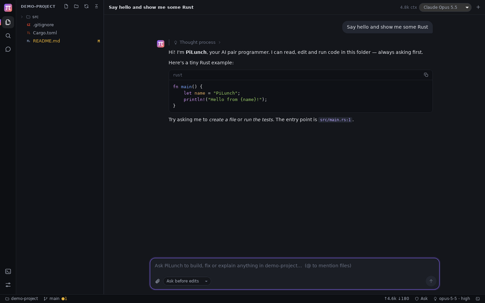
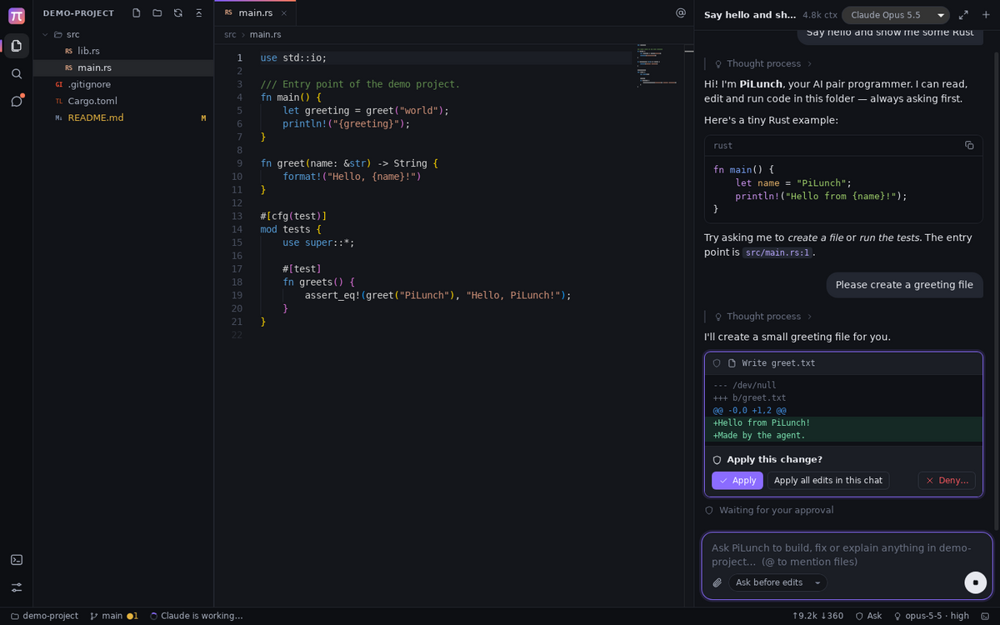
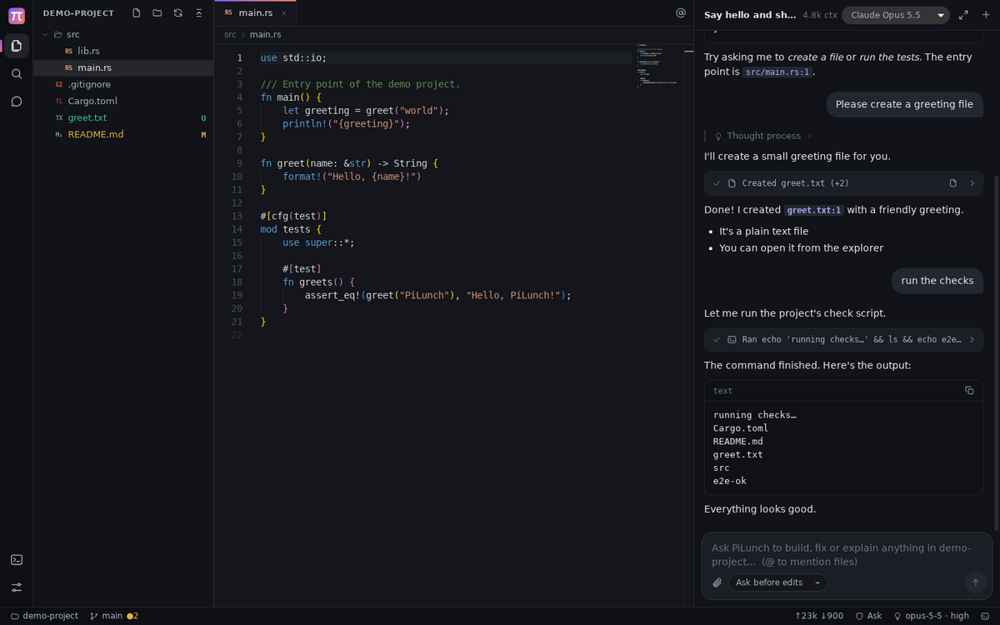

# PiLunch

**PiLunch is a desktop AI code editor for Linux (and Windows).** It's built chat-first, like the ChatGPT and Claude desktop apps, but it can work on your project: Claude reads your code, edits files and runs commands, and asks you before changing anything. It also includes a real code editor, file explorer, search and terminal.

The core is written in **Rust** (Tauri 2) and the UI in **TypeScript** (React + Monaco + xterm.js).



| Reviewing an edit before it's applied | Commands, results and the editor side by side |
|---|---|
|  |  |

<sub>Screenshots come from the automated end-to-end test, which drives the real app with scripted model responses.</sub>

## Features

- **A coding agent in a chat window.** Ask in plain language. Claude explores the project (`list_dir`, `glob`, `grep`, `read_file`), makes focused edits (`edit_file`, `write_file`) and runs builds and tests (`run_command`), streaming as it works.
- **You stay in control.** Every edit is shown as a diff and every command as text before it runs. You can **Apply**, **Allow for this chat**, or **Deny** with feedback ("use a markdown file instead"), and Claude adjusts. There are four permission modes: *Ask*, *Auto-accept edits*, *Plan* (read-only) and *Bypass*.
- **A real editor.** Monaco (the editor inside VS Code) with tabs, syntax highlighting for 80+ languages, minimap and sticky scroll. Files the agent changes reload live, and unsaved work is never overwritten.
- **Project tools.** A gitignore-aware explorer with git status colors, ripgrep-powered search, fuzzy quick-open (`Ctrl+P`), a command palette (`Ctrl+Shift+P`) and an integrated terminal with real PTYs.
- **Context made easy.** Type `@` to attach files, or press `Ctrl+L` to send the editor selection to the chat. Clickable `path:line` references in answers jump straight to the code.
- **Chat history**, grouped by day and by project. Runs continue in the background while you switch chats.
- **Project instructions.** If a `PILUNCH.md`, `AGENTS.md` or `CLAUDE.md` exists at the project root, its contents are added to the system prompt.
- **Dark and light themes** (or follow the system).

### Built for speed

- Everything heavy runs in Rust: file walking and search use ripgrep's own crates (`ignore`, `grep-searcher`) in parallel, quick-open uses Helix's `nucleo` fuzzy matcher over an in-memory index, and diffs are computed with `similar`.
- The explorer is virtualized and loads folders lazily, so huge repositories open instantly.
- Token streams are batched in Rust (at most ~30 UI updates per second), and finished markdown blocks are memoized, so long answers don't re-render.
- Terminal output reaches xterm.js as raw bytes over a binary IPC channel with no JSON or base64 encoding, and xterm renders with WebGL.
- Monaco (~4 MB) and xterm load on first use, which keeps startup light.
- Release builds use `opt-level=3`, fat LTO and a single codegen unit.

## Install

### Linux

Build the packages (see below), then install the one for your distribution:

```bash
sudo apt install ./src-tauri/target/release/bundle/deb/PiLunch_0.1.0_amd64.deb      # Debian/Ubuntu
sudo dnf install ./src-tauri/target/release/bundle/rpm/PiLunch-0.1.0-1.x86_64.rpm     # Fedora/RHEL
```

The build can also produce an AppImage: `npm run tauri build -- --bundles appimage`.

### Windows

Run `npm run app:build` on Windows. It produces an `.msi` and an NSIS `.exe` installer in `src-tauri/target/release/bundle/`. WebView2 is preinstalled on Windows 10/11.

## Getting started

1. Start PiLunch and paste your Anthropic API key, from [console.anthropic.com](https://console.anthropic.com), into the welcome screen. You can also open **Settings** (`Ctrl+,`), or set `ANTHROPIC_API_KEY` in your environment.
2. Click **Open Folder** and choose a project.
3. Ask for something, for example: *"Find why the tests fail and fix it."*

The default model is **Claude Opus 5.5** at *high* effort. You can switch to Sonnet 5.5 (faster), Fable 5.1 (most capable) or Haiku 4.5 (quickest) from the chat header, or type any model id in Settings.

## Keyboard shortcuts

| Action | Shortcut |
|---|---|
| Go to file | `Ctrl+P` |
| Command palette | `Ctrl+Shift+P` / `F1` |
| Open folder | `Ctrl+O` |
| New chat / focus chat input | `Ctrl+N` / `Ctrl+K` |
| Send selection (or file) to chat | `Ctrl+L` |
| Stop Claude | `Esc` in the chat input |
| Toggle chat focus mode | `Ctrl+Shift+L` |
| Save / save all | `Ctrl+S` / `Ctrl+Alt+S` |
| Close tab | `Ctrl+W` |
| Explorer / search / chats | `Ctrl+Shift+E` / `Ctrl+Shift+F` / `Ctrl+Shift+H` |
| Toggle sidebar / terminal | `Ctrl+B` / `Ctrl+J` |
| Settings | `Ctrl+,` |

## Security model

- **Workspace sandbox.** Every file path from the UI or the agent goes through one resolver in Rust (`src-tauri/src/workspace.rs`). It rejects `..` escapes, absolute paths outside the folder, and symlinks that point outside.
- **Approvals happen in Rust.** In *Ask* mode, an edit or command doesn't run until you approve it. An edit is re-checked before writing: if the file changed after the diff was shown, the write is refused.
- **Commands** run in the project folder with no stdin, a timeout (120 s by default, 600 s max), and their own process group, so cancelling or timing out kills the whole process tree.
- **Your API key** is stored in `~/.config/pilunch/secrets.json` with `0600` permissions. It is never sent to the web view; the UI only sees whether a key is set and its last four characters.
- **The web view** runs under a strict Content Security Policy with no remote scripts. Markdown is rendered without raw HTML.

## Building from source

Prerequisites: Rust (stable), Node.js 20 or later, and on Linux the WebKitGTK development packages:

```bash
# Debian/Ubuntu
sudo apt install build-essential pkg-config libwebkit2gtk-4.1-dev libgtk-3-dev \
  libsoup-3.0-dev libjavascriptcoregtk-4.1-dev librsvg2-dev libayatana-appindicator3-dev libssl-dev
# Fedora
sudo dnf install webkit2gtk4.1-devel gtk3-devel libsoup3-devel librsvg2-devel openssl-devel
```

Then:

```bash
npm install
npm run app:dev      # run with hot reload
npm run app:build    # optimized build + installers in src-tauri/target/release/bundle/
```

## Development

```bash
npm run typecheck    # TypeScript
npm test             # UI unit tests (vitest)
npm run test:rust    # Rust unit + agent-loop tests (mock Messages API, no network)
npm run e2e          # drives the real app over WebDriver; screenshots in e2e/out/
```

The end-to-end test needs `tauri-driver` (`cargo install tauri-driver`), `WebKitWebDriver` (`apt install webkit2gtk-driver`), `xvfb` and `dbus`.

### Layout

```
src-tauri/src/            Rust core
  agent/                  Claude agent: api.rs (HTTP + request options), sse.rs (stream parsing),
                          tools.rs (tool definitions and implementations), prompt.rs, mod.rs (the loop)
  workspace.rs            path sandbox
  search.rs               file index, fuzzy matching, grep
  fs_ops.rs  git.rs  terminal.rs  watcher.rs  settings.rs  conversations.rs  commands.rs
src/                      TypeScript UI
  store/                  zustand stores (app, editor, chat)
  components/             chat/, editor/, sidebar/, terminal, palette, settings…
e2e/                      WebDriver end-to-end test + mock Messages API
```

### Where data lives

| What | Linux | Windows |
|---|---|---|
| Settings, API key | `~/.config/pilunch/` | `%APPDATA%\pilunch\` |
| Chat history | `~/.local/share/pilunch/conversations/` | `%APPDATA%\pilunch\conversations\` |

You can override these with `PILUNCH_CONFIG_DIR` and `PILUNCH_DATA_DIR`.

## Not there yet

- Claude (the Anthropic API) is the only provider. There is no OpenAI or local-model support yet.
- No language-server integration (go-to-definition, project-wide type checking).
- There are no agent checkpoints: undo the agent's changes with the editor's undo or with git.
- The Windows build is set up but has not been tested as thoroughly as Linux.
